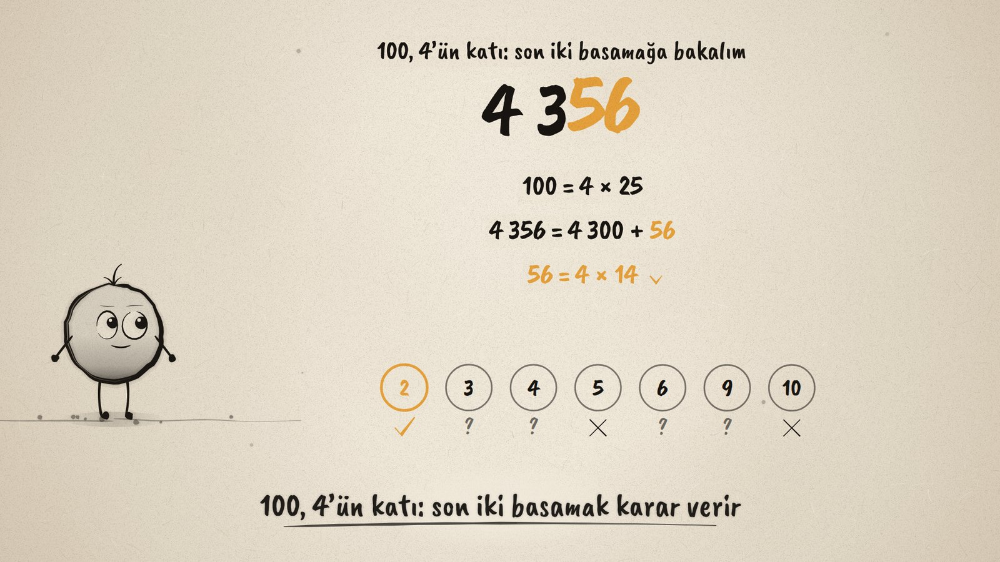
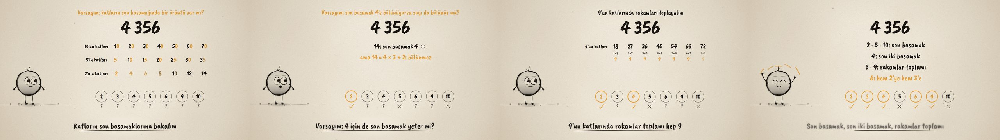

# Bölünür mü? · Divisibility Rules

**▶ Tarayıcıda izleyin / Watch in the browser:** https://hakanatas.github.io/bolunur-mu/ 
**⬇ MP4 + altyazılar / MP4 + subtitles:** [Releases](https://github.com/hakanatas/bolunur-mu/releases) 
**✎ Kullanılan istem / The prompt behind it:** [PROMPT.md](PROMPT.md) 
**🎞 Bütün filmler / All films:** [Nokta'nın Filmleri](https://hakanatas.github.io/nokta-filmleri/?sinif=6)

> **TR —** 6. sınıf matematik "Sayılar ve Nicelikler" temasındaki MAT.6.1.2 öğrenme çıktısı için hazırlanmış, tamamen JavaScript ile çizilen 92 saniyelik mürekkep animasyonu. Soru: 4 356 sayısı 2, 3, 4, 5, 6, 9 ve 10'dan hangilerine tam bölünür, bölme yapmadan anlayabilir miyiz? 10'un, 5'in ve 2'nin katlarındaki son basamak örüntüsünden bir varsayım kuruluyor; 4 356 = 4 350 + 6 ayrışımı neden yalnızca birler basamağına bakıldığını açıklıyor. "4 için de son basamak yeter" varsayımı 14 ile sınanıp çürüyor; 100 = 4 × 25 olduğu için son iki basamağa bakılıyor. 9'un katlarında rakamlar toplamı hep 9 çıkıyor; 10 = 9 + 1, 100 = 99 + 1 bunun nedenini gösteriyor. 6 için 2 ve 3 kuralı birlikte kullanılıyor. Sonunda kuralların ne zaman işe yaradığı tartışılıyor: 4 356 kalem 9 kutuya eşit dağılır, ama 7 için kısa bir kural yok. Her karar alttaki panoya işleniyor. Altyazılar Türkçe, İngilizce ya da ikisi birlikte seçilebilir.

A 92-second ink animation for **6th-grade maths**, drawn entirely with JavaScript on an HTML5 canvas. Nokta, the ink character from [The Learning Ink](https://github.com/hakanatas/the-learning-ink), is the guide again. The digit sums under the multiples of 9 are computed from the numbers, not typed in, and every verdict on the board is one entry in a small table (`VERDICT` in `scenes/scene1.js`).

## Learning outcome

MEB, Türkiye Yüzyılı Maarif Modeli, Ortaokul Matematik, 6th grade, "Sayılar ve Nicelikler" theme:

**MAT.6.1.2. Bir doğal sayının 2, 3, 4, 5, 6, 9 ve 10 ile tam bölünebilme kriterlerine ilişkin çıkarım yapabilme**
- a) Bir doğal sayının katlarını veya basamak değerlerini dikkate alarak 2, 3, 4, 5, 6, 9 ve 10'a tam bölünebilme kriterleri ile ilgili varsayımlarda bulunur.
- b) 2, 3, 4, 5, 6, 9 ve 10'un katlarını ve basamak değerlerini inceleyerek genellemeleri belirler.
- c) Elde ettiği genellemelerin, varsayımını karşılayıp karşılamadığını örnekler ile sınar.
- ç) Bir doğal sayının 2, 3, 4, 5, 6, 9 ve 10 ile tam bölünebilmesindeki kriterlere ilişkin önerme sunar.
- d) Bir doğal sayının 2, 3, 4, 5, 6, 9 ve 10 ile tam bölünebilmesindeki kriterlerin farklı durumlarda kullanışlılığını değerlendirir.

## Scenes

| # | Time | Scene | What happens | Outcome |
|---|---|---|---|---|
| 1 | 0–10 s | Hangisine bölünür? | 4 356 and a board of seven divisors, each with a question mark. | a |
| 2 | 10–28 s | Son basamak | Last digits of the multiples of 10, 5 and 2. 4 356 = 4 350 + 6: only the ones digit decides. 2 yes, 5 and 10 no. | a, b, ç |
| 3 | 28–46 s | Son iki basamak | Guess: the last digit is enough for 4. 14 breaks it. 100 = 4 × 25, so look at 56 = 4 × 14. 4 yes. | a, b, c, ç |
| 4 | 46–66 s | Rakamlar toplamı | Digit sums of multiples of 9 are all 9. 10 = 9 + 1, 100 = 99 + 1. 4 + 3 + 5 + 6 = 18: 9 yes, 3 yes. | b, ç |
| 5 | 66–80 s | İki kural birden | 6 = 2 × 3, so 6 yes. When are the rules useful? 4 356 pens into 9 boxes; for 7 there is no short rule. | ç, d |
| 6 | 80–92 s | Aklında kalsın | Last digit, last two digits, digit sum, both 2 and 3. | ç |

## Running it

- **Preview:** double-click `index.html` (it works offline).
- **MP4:** run `npm install` once, then `npm run export -- --format=horizontal --captions=tr`.
- **Subtitles and narration:** `npm run srt` writes `out/captions_*.srt` and `narration_notes.txt`.
- **Editing:**
  - Caption text, timings and narration notes: `captions.js`
  - Everything on screen is drawn by `LI.world(t)` in `scenes/scene1.js` (the timed lines, the rows of multiples, the board verdicts); the other scenes only set the camera.
  - The big number with glowing digits, the board, and Nokta's poses: `src/draw/film.js`; layout for 16:9 and 9:16: `src/draw/kd.js`

It uses the same engine as The Learning Ink: `renderFrame(t)` as a pure function of time, seeded randomness, and frame-by-frame export.
